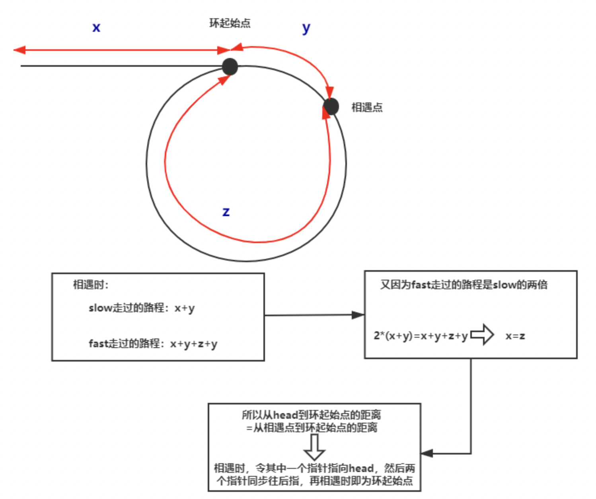
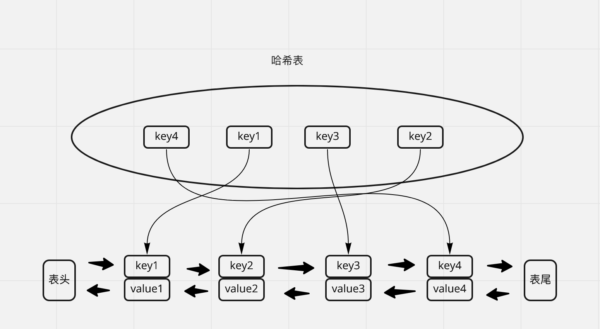

## Linklist

#### (1) 常用技巧总结

- 添加哑节点： 何时需要使用 dummy 节点? 当可能会修改链表的头结点的时候， 需要申请一个 dummy 节点

  ~~~c++
  // 建立
  ListNode * dummy = new ListNode(0);
  dummy -> next = head;
  
  // 释放: 不要忘记释放 dummy 节点 (如果申请了)   !! leetcode 平台的原因, 不释放是不影响编译的
  ListNode * newhead = dummy -> next;
  delete dummy;
  return newhead;
  ~~~
  
- 头指针一般不可以随意改变， 可以申请一个指向头指针的指针

  ~~~
  ListNode * ptr = head;
  ~~~

- 保持清晰的头脑很重要，不要让链表断开了， 适当的在纸上模拟一下对应的链表指向操作。

- 注意一下常见的边界条件：头结点 和 尾结点， 链表为空， 只有一个节点。

- 常见的技巧： 使用快慢指针、建立一个 Node2index 的 映射

- 注意些小细节：dummy 节点的释放、删除节点的释放，末尾指针不要乱指、 如果要翻转某段链表、要确保翻转部分的尾结点指向 NULL。

- 通过 for 循环定位节点的方法， 如果实在分不清楚， 可以拿着示例进行模拟

  ~~~cpp
  // ptr 移动了 len 次, 如果 ptr = head, 则移动后, ptr 指向 len + 1 个节点  !!! 
  // 如果实在有点混淆, 可以拿示例去模拟下
  for(int i = 0; i < len; i++){
    ptr = ptr -> next; 
  }
  ~~~

- 基本的代码块

  ~~~cpp
  // 求链表长度
  int len = 0;
  ListNode * cur = head;
  while(cur){
      cur = cur -> next;
      len++;
  }
  ~~~

#### (2) 典型例题

### 题型一：翻转链表

##### [206. 翻转链表](https://leetcode-cn.com/problems/reverse-linked-list/)

~~~cpp
// 翻转链表: leetcode 206: https://leetcode-cn.com/problems/reverse-linked-list/ | 剑指 offer 24
// ! 翻转完成后原来的 head 指针指向尾结点
ListNode* reverseList(ListNode* head) { 
    if(head == NULL) return NULL;

    ListNode * prev = NULL;
    ListNode * cur = head;
    while(cur){
        ListNode * next = cur -> next;
        cur -> next = prev;
        prev = cur;
        cur = next;
    }
    return prev;
}

// 递归写法! 字节跳动
ListNode* reverseList(ListNode* head) {
        // 递归退出条件
        if(head == nullptr || head -> next == nullptr) return head;
        // 标记递归节点
        ListNode * last = reverseList(head -> next);
        // 改变指向
        head -> next -> next = head;
        head -> next = NULL;
        // 返回
        return last;
}
~~~

##### [92. 反转链表 II](https://leetcode-cn.com/problems/reverse-linked-list-ii/)   ⭐️⭐️⭐️⭐️

~~~cpp
//  美团 3.31、字节抖音后端 
// !! 经典题目, 细节之处见真章
// 理清楚思路, 找到翻转部分的前驱节点(prev) 和翻转部分的后继节点(next) 很重要

ListNode* reverseBetween(ListNode* head, int left, int right) {
    if(head == NULL) return NULL;
    // 可能会修改头节点, 所以需要添加 dummy 节点
    ListNode * dummy = new ListNode(-1);
    dummy -> next = head;

    ListNode * ptr = dummy;
    // 移动到 prev 节点
    int i = 0;
    for(i = 0; i < left - 1; i++) 
      ptr = ptr -> next;
    ListNode * prev = ptr;

    for(; i < right; i++) // 继续走, 找到翻转部分的最后的节点
      ptr = ptr -> next;
    ListNode * next = ptr -> next;
    ptr -> next = NULL;  // 结尾指针指向空, 才能完成翻转

    
    prev -> next = reverseList(prev -> next);  // 翻转指定部分

    // 连接断掉的链表  x -> next
    while(prev->next)  prev = prev -> next;   
    prev -> next = next;
    // 删除 demmy 节点
    ListNode * newhead = dummy-> next;
    delete dummy;
    return newhead;
}
~~~

##### [24. 两两交换链表中的节点](https://leetcode-cn.com/problems/swap-nodes-in-pairs/)

~~~cpp
// leetcode 24
ListNode* swapPairs(ListNode* head) {
    ListNode * dummy = new ListNode(-1);
    dummy -> next = head;

    ListNode * ptr = dummy;
    while(ptr && ptr -> next && ptr -> next -> next){
        ListNode * tail = ptr -> next -> next;
        ListNode * next = tail -> next; 

        tail -> next = ptr -> next;
        ptr -> next = tail;
        tail -> next -> next = next;

        ptr = ptr -> next -> next;
    }
    
    ListNode * newhead = dummy -> next;
    delete dummy;
    return newhead;
}
~~~

##### [25. K 个一组翻转链表](https://leetcode-cn.com/problems/reverse-nodes-in-k-group/)    ⭐️⭐️⭐️⭐️

~~~cpp
// 美团、腾讯、快手、字节
// ! 理清楚思路很重要的, 先不要考虑不足k个的问题
// 一般执行的步骤是: 找k个节点、标记四个节点(prev、start、tail、next)、断掉tai->next、翻转、连接翻转链表、移动指针
ListNode* reverseLists(ListNode * head){
    ListNode * prev = NULL;
    ListNode * cur = head;
    while(cur){
        ListNode * next = cur -> next;
        cur -> next = prev;
        prev = cur;
        cur = next;
    }
    return prev;
}

ListNode* reverseKGroup(ListNode* head, int k) {
    ListNode * dummy = new ListNode(-1);
    dummy -> next = head;

    ListNode * prev = dummy;
    ListNode * tail = dummy;
    while(prev -> next != NULL){
        // (1) prev、start、tail、next 四个指针的定位
        for(int i = 0; i < k && tail != NULL; i++){
            tail = tail -> next;  // 并不能在 for 循环内部 break
        }
        if(tail == NULL) break;
        ListNode * start = prev -> next;
        ListNode * next = tail -> next;
      
        // (2) 实现翻转
        tail -> next = NULL;
        prev -> next = reverseLists(start);  // 原来的 start 指向链表末尾 !!!
        start -> next = next;

        // (3) 移动指针
        prev = start;
        tail = start;
    }
    

    ListNode * newhead = dummy -> next;
    delete dummy;
    return newhead;

}
~~~

扩展: 不足 k  个也要翻转应该怎么做

将如下代码进行替换即可:

~~~cpp
for(int i = 0; i < k && tail != NULL; i++){
    tail = tail -> next;  // 并不能在 for 循环内部 break
}
if(tail == NULL) break;

// 替换为: 指针走到末尾节点终止即可，也无需跳出循环
for(int i = 0; (i < k-1) && (tail -> next != NULL); i++){
    tail = tail -> next;
}
~~~

### 题型二： 环状链表

##### [141. 环形链表](https://leetcode-cn.com/problems/linked-list-cycle/)

~~~cpp
bool hasCycle(ListNode *head) {
    ListNode * fast = head;
    ListNode * slow = head;
    while(fast && fast -> next){
        fast = fast -> next -> next;
        slow = slow -> next;
        if(fast == slow) return true;
    }
    return false;        
}
~~~

##### [142. 环形链表 II](https://leetcode-cn.com/problems/linked-list-cycle-ii/)

~~~cpp
// [剑指 Offer II 022. 链表中环的入口节点](https://leetcode-cn.com/problems/c32eOV/)
// [面试题 02.08. 环路检测](https://leetcode-cn.com/problems/linked-list-cycle-lcci/)

ListNode *detectCycle(ListNode *head) {
    ListNode * fast = head;
    ListNode * slow = head;

    while(fast && fast -> next){
        fast = fast -> next -> next;
        slow = slow -> next;
        if(fast == slow) break;
    }
    if(fast == NULL || fast -> next == NULL) return NULL;  // linklist have no cycle

    slow = head;
    while(fast && slow){
        if(fast == slow) return fast;
        fast = fast -> next;
        slow = slow -> next;
    }
    return NULL;
}
~~~

理论性解释:

扩展问题：

（1）如何求柄的长度， 即上图的 x。 解答： 如上图所示， 相遇后，让两个指针分别从相遇点和开头进行移动， 步长为1， 相遇时， 两个指针分别均各自移动了 x 步

（2）如何求环的长度， 即上图的 y + z。 解答： 如上图所示， 相遇后，让两个指针均从相遇点进行移动， fast 指针步长为2， slow 指针步长为 1， 两个指针再次相遇时， slow 指针移动了 y + z 步，fast 指针移动了 2 * (y + z) 步。

### 题型三  排序链表

##### [21. 合并两个有序链表](https://leetcode-cn.com/problems/merge-two-sorted-lists/)

~~~cpp
// leetcode 21 | 剑指 offer 25
ListNode* mergeTwoLists(ListNode* l1, ListNode* l2) {
    ListNode * dummy = new ListNode(-1);
    ListNode * ptr = dummy;
    ListNode * ptr1 = l1;
    ListNode * ptr2 = l2;

    while(ptr1 && ptr2){
        if(ptr1 -> val > ptr2 -> val){
            ptr -> next = ptr2;
            ptr2 = ptr2 -> next;
        }else{
            ptr -> next = ptr1;
            ptr1 = ptr1 -> next;
        }
        ptr = ptr -> next;
    }

    if(ptr1 == NULL){
        ptr -> next = ptr2;
    }else{
        ptr -> next = ptr1;
    }

    ListNode * new_head = dummy -> next;
    delete dummy;
    return new_head;
}
~~~

##### [23. 合并K个升序链表](https://leetcode-cn.com/problems/merge-k-sorted-lists/)  ⭐️⭐️⭐️⭐️

~~~cpp
// leetcode 23 | 剑指 offer || 078
ListNode* mergeKLists(vector<ListNode*>& lists) {
    if(lists.size() == 0) return NULL;
    if(lists.size() == 1) return lists[0];
    if(lists.size() == 2) return mergeTwoLists(lists[0], lists[1]);

    vector<ListNode *> l1;
    vector<ListNode *> l2;
    int mid = lists.size() / 2;
    for(int i = 0; i < lists.size(); i++){
        if(i < mid) l1.push_back(lists[i]);
        else l2.push_back(lists[i]);
    }

    ListNode * p1 = mergeKLists(l1);
    ListNode * p2 = mergeKLists(l2);
    return mergeTwoLists(p1, p2);
}
~~~

扩展1： 分析该算法的算法复杂度

扩展2： 另一种解法是使用优先队列(堆)   ⭐️

扩展3： 不用合并，而是去重打印  ⭐️

##### [148. 排序链表](https://leetcode-cn.com/problems/sort-list/)      ⭐️⭐️⭐️⭐️

~~~cpp
// 莉莉丝  微软  百度
ListNode * merge(ListNode * p1, ListNode * p2){
    if(p1 == NULL) return p2;
    if(p2 == NULL) return p1;

    if(p1 -> val > p2 -> val){
        p2 -> next = merge(p2->next, p1);
        return p2;
    }else{
        p1 -> next = merge(p1->next, p2);
        return p1;
    }

    return NULL;
}

ListNode* sortList(ListNode* head) {
    if(head == NULL || head -> next == NULL) return head;

    ListNode * fast = head;
    ListNode * slow = head;
    ListNode * pre = head;
    while(fast && fast -> next){
        pre  = slow;
        fast = fast -> next -> next;
        slow = slow -> next;
    }
    pre-> next = NULL;  // 最核心的一步
  
    return merge(sortList(head), sortList(slow));
}
~~~

### 题型四：双指针

##### [剑指 Offer 22. 链表中倒数第k个节点](https://leetcode-cn.com/problems/lian-biao-zhong-dao-shu-di-kge-jie-dian-lcof/)

~~~cpp
// leetcode 22 | 面试题 02.02
ListNode* getKthFromEnd(ListNode* head, int k) {
    ListNode * fast = head;
    ListNode * slow = head;

    // 这里走了 k+1 步 ! 这里没有考虑异常情况
    for(int i = 0; i < k; i++){
        fast = fast -> next;
    }

    while(fast != NULL){
        fast = fast -> next;
        slow = slow -> next;
    }

    return slow;  // 02.02 这里返回的是 slow->val
}
~~~

##### [19. 删除链表的倒数第 N 个结点](https://leetcode-cn.com/problems/remove-nth-node-from-end-of-list/)

~~~cpp
// [剑指 Offer II 021. 删除链表的倒数第 n 个结点](https://leetcode-cn.com/problems/SLwz0R/)
ListNode* removeNthFromEnd(ListNode* head, int n) {
    // 思考思路: 
    // 先思考结束的条件: p_slow 指向删除节点的前一个节点, p_fast 指向最后的空节点
    //                p_slow              p_fast
    //   1  ->   2  ->  3 ->  4 ->  5  ->  NULL

    // 所以初始的条件为:  p_slow 指向第一个节点(dummy), p_fast 实际移动了 n + 1 次
    //  p_slow                  p_fast
    //  dummy  ->  1  ->   2  ->  3 ->  4 ->  5  ->  NULL
    if(head == NULL) return NULL;

    ListNode * dummy = new ListNode(-1);
    dummy -> next = head;

    ListNode * p_fast = dummy;
    ListNode * p_slow = dummy;

    for(int i = 0; i < n + 1; i++){
        if(p_fast == NULL) return head;
        p_fast = p_fast -> next;
    }

    while(p_fast){
        p_fast = p_fast -> next;
        p_slow = p_slow -> next;
    }
    
    ListNode* deleteNode = p_slow -> next;
    p_slow -> next = p_slow -> next -> next;
    delete deleteNode;

    ListNode * newhead = dummy -> next;
    delete dummy;
    return newhead;
}
~~~

##### [2. 两数相加](https://leetcode-cn.com/problems/add-two-numbers/)

~~~cpp
// 面试题 02.05: 链表求和
// [剑指 Offer II 025. 链表中的两数相加](https://leetcode-cn.com/problems/lMSNwu/)
// [445. 两数相加 II](https://leetcode-cn.com/problems/add-two-numbers-ii/)

// 美团一面
ListNode* addTwoNumbers(ListNode* l1, ListNode* l2) {
    ListNode * dummy = new ListNode(-1);
    ListNode * ptr = dummy;

    ListNode * ptr1 = l1;
    ListNode * ptr2 = l2;

    int c_in  = 0;
    while(ptr1 || ptr2){
        int t1 = ptr1 == NULL ? 0 : ptr1 -> val; // 很巧妙的利用了三元组的性质
        int t2 = ptr2 == NULL ? 0 : ptr2 -> val;

        int s = t1 + t2 + c_in;
        ListNode* t_node = new ListNode(s % 10);
        c_in = s / 10;
        ptr-> next = t_node;

        if(ptr1 != NULL) ptr1 = ptr1 -> next; // 容易忽略的地方
        if(ptr2 != NULL) ptr2 = ptr2 -> next;
        ptr = ptr -> next;
    }

    // 这个也是容易忽略的地方
    if(c_in){
        ptr -> next = new ListNode(c_in);
    }

    ListNode* new_head = dummy -> next; 
    delete dummy;  // 注意释放 dummy 指针
    return new_head;
}
~~~

##### [160. 相交链表](https://leetcode-cn.com/problems/intersection-of-two-linked-lists/)

~~~cpp
// [面试题 02.07. 链表相交](https://leetcode-cn.com/problems/intersection-of-two-linked-lists-lcci/)
// [剑指 Offer II 023. 两个链表的第一个重合节点](https://leetcode-cn.com/problems/3u1WK4/)
// [剑指 Offer 52. 两个链表的第一个公共节点](https://leetcode-cn.com/problems/liang-ge-lian-biao-de-di-yi-ge-gong-gong-jie-dian-lcof/)

// 求链表长度的基础代码
int getLenofList(ListNode * head){
    int len = 0;
    ListNode * ptr = head;
    while(ptr){
        ptr = ptr->next;
        len++;
    }
    return len;
}

ListNode *getIntersectionNode(ListNode *headA, ListNode *headB) {
    int lenA = getLenofList(headA);
    int lenB = getLenofList(headB);

    int diff = abs(lenA - lenB);

    ListNode * ptrA = headA;
    ListNode * ptrB = headB;

    if(lenA > lenB){
        for(int i = 0; i < diff; i++){
            ptrA = ptrA -> next;
        }
    }else{
        for(int i = 0; i < diff; i++){
            ptrB = ptrB -> next;
        }
    }
    while(ptrA && ptrB){
        if(ptrA == ptrB) return ptrA;
        ptrA = ptrA -> next;
        ptrB = ptrB -> next;
    }
    return NULL;
}
~~~

##### [876. 链表的中间结点](https://leetcode-cn.com/problems/middle-of-the-linked-list/)

~~~cpp
ListNode* middleNode(ListNode* head) {
    if(head == NULL || head -> next == NULL) return head;
    ListNode * fast = head;
    ListNode * slow = head;
    while(fast && fast -> next){
        slow = slow -> next;
        fast = fast -> next -> next;
    }
    return slow;
}
~~~

##### [234. 回文链表](https://leetcode-cn.com/problems/palindrome-linked-list/)

~~~cpp
// leetcode 234 | 剑指 offer 027 | 面试题 02.06 
// 美团 2020.09 二面
bool isPalindrome(ListNode* head) {
    if(head == NULL || head -> next == NULL) return true;
    // 统计节点个数
    int len = 0;
    ListNode * ptr = head;
    while(ptr){
        ptr = ptr -> next;
        len++;
    }
  
    // 翻转后半部分链表
    len = (len + 1) / 2;
    ptr = head;
    for(int i = 0; i < len - 1; i++){
        ptr = ptr -> next;
    }
    ListNode * new_head = reverseLists(ptr->next);
    ptr -> next = NULL;
    
    // 比对两半部分的链表
    ListNode * ptr1 = head;
    ListNode * ptr2 = new_head;
    while(ptr1 && ptr2){
        if(ptr1 -> val != ptr2 -> val) return false;
        ptr1 = ptr1 -> next;
        ptr2 = ptr2 -> next;
    }
    return true;
}

// 求中间节点的两种方法(奇数的中间节点、偶数的中间节点的前一个)
// (1) fast 和 slow 双指针, 额外添加一个 prev 指针进行定位
// (2) 先求长度 len, 然后 len = (len+1) / 2, 最后走 len -1 步即可
~~~

### 题型五 元素删除

##### [237. 删除链表中的节点](https://leetcode-cn.com/problems/delete-node-in-a-linked-list/)

~~~cpp
// leetcode 237
void deleteNode(ListNode* node) {
    node -> val = node -> next -> val;
    ListNode * deleteNode = node -> next;
    node -> next = node -> next -> next;
    delete deleteNode;
}
~~~

##### [83. 删除排序链表中的重复元素](https://leetcode-cn.com/problems/remove-duplicates-from-sorted-list/)

~~~cpp
ListNode* deleteDuplicates(ListNode* head) {
    if(head == NULL || head -> next == NULL) return head;
    ListNode * ptr = head;

    while(ptr && ptr -> next){
        if(ptr -> val == ptr -> next -> val){
            ptr -> next = ptr -> next -> next;
        }else{
            ptr = ptr -> next;
        }
    }
    return head;
}
~~~

##### [203. 移除链表元素](https://leetcode-cn.com/problems/remove-linked-list-elements/)

~~~cpp
// 可能会修改头结点 -> 需要使用 dummy node
ListNode* removeElements(ListNode* head, int val) {
    ListNode * dummy = new ListNode(-1);
    dummy -> next = head;

    ListNode * ptr = dummy;
    while(ptr && ptr -> next){
        if(ptr-> next -> val == val){
            ptr -> next = ptr -> next -> next;
        }else{
            ptr = ptr -> next;
        }
    }

    ListNode * newhead = dummy -> next;
    delete dummy;
    return newhead;
}
~~~

##### [82. 删除排序链表中的重复元素 II](https://leetcode-cn.com/problems/remove-duplicates-from-sorted-list-ii/)    ⭐️⭐️⭐️⭐️

~~~cpp
ListNode* deleteDuplicates(ListNode* head) {
    ListNode * dummy = new ListNode(-101);
    dummy -> next = head;

    ListNode * prev = dummy;
    ListNode * ptr = head;
    while(ptr){
        ListNode * next = ptr -> next;
        while(next && next -> val == ptr -> val){
            next = next -> next;
        }

        if(ptr->next != next){ // ! 有重复元素
            prev -> next = next;
        }else{      // 没有重复元素
            prev = ptr;
        }
        ptr = next;

    }
    return dummy -> next;
}
~~~

##### [面试题 02.01. 移除重复节点](https://leetcode-cn.com/problems/remove-duplicate-node-lcci/)

~~~cpp
ListNode* removeDuplicateNodes(ListNode* head) {
    if(head == NULL || head -> next == NULL) return head;

    set<int> m_set = {head->val};
    ListNode * ptr = head;
    while(ptr -> next){
        if(m_set.find(ptr -> next -> val) != m_set.end()){
            ptr -> next = ptr -> next -> next;
        }else{
            ptr = ptr -> next;
            m_set.insert(ptr->val);
        }
    }
    return head;
}
~~~

### 题型六 链表重排

##### [61. 旋转链表](https://leetcode-cn.com/problems/rotate-list/)

~~~cpp
// 字节一面
ListNode* rotateRight(ListNode* head, int k) {
    if(head == NULL || head -> next == NULL) return head;
    int len = 1;
    ListNode * ptr = head;
    while(ptr->next){
        ptr = ptr -> next;
        len++;
    } 
    ptr -> next = head; // point tail to head

    k = len - k % len;
    
    ptr = head;
    for(int i = 0; i < k - 1; i++){
        ptr = ptr -> next;
    }

    ListNode * new_head = ptr -> next;
    ptr -> next = NULL;
    return new_head;
}
~~~

##### [328. 奇偶链表](https://leetcode-cn.com/problems/odd-even-linked-list/)

~~~cpp
ListNode* oddEvenList(ListNode* head) {
    if(head == NULL || head->next == NULL) return head;

    int idx = 1;
    ListNode * odd_ptr = new ListNode(-1);
    ListNode * p1 = odd_ptr;
    ListNode * even_ptr = new ListNode(-1);
    ListNode * p2 = even_ptr;

    ListNode * ptr = head;
    while(ptr){
        if(idx % 2){
            p1 -> next = ptr;
            p1 = p1-> next;
        }else{
            p2 -> next = ptr;
            p2 = p2 -> next;
        }
        ptr = ptr -> next;
        ++idx;
    }
    p1 -> next = even_ptr -> next;
    p2 -> next = NULL;

    ListNode * newhead = odd_ptr -> next;
    delete even_ptr;
    delete odd_ptr;
    return newhead;
}
~~~

##### [86. 分隔链表](https://leetcode-cn.com/problems/partition-list/)

~~~cpp
ListNode* partition(ListNode* head, int x) {
    ListNode * ptr_less = new ListNode(-1);
    ListNode * ptr1 = ptr_less;
    ListNode * ptr_greater = new ListNode(-1);
    ListNode * ptr2 = ptr_greater;

    ListNode * ptr = head;
    while(ptr){
        if(ptr -> val >= x){
            ptr2 -> next = ptr;
            ptr2 = ptr2 -> next;
        }else{
            ptr1 -> next = ptr;
            ptr1 = ptr1 -> next;
        }
        ptr = ptr -> next;
    }

    ptr2 -> next = NULL;
    ptr1 -> next = ptr_greater -> next;
    delete ptr_greater;

    ListNode * newhead = ptr_less -> next;
    delete ptr_less;
    return newhead; 
}
~~~

##### [143. 重排链表](https://leetcode-cn.com/problems/reorder-list/)

~~~cpp
// 哲库、乐鑫7.20、美团、快手、字节
void reorderList(ListNode* head) {
    if(head == NULL && head -> next == NULL) return;

    ListNode * slow = head;
    ListNode * fast = head;
    while(fast -> next && fast -> next -> next){  // 注意这里的退出条件
        slow = slow -> next;
        fast = fast -> next -> next;
    }
    ListNode * tail = reverseList(slow-> next);
    slow -> next = NULL;

    ListNode * ptr = head;
    while(ptr && tail){
        ListNode * next = ptr -> next;
        ptr -> next = tail;
        ptr = next;

        ListNode tail_next = tail -> next;
        tail -> next = ptr;
        tail = tail_next;
    }
  
    // 不用做后处理: 无论是奇数还是偶数, 都会保持链表的完整和正确
    return;
}
~~~

### 题型七 两道经典题目

##### [138. 复制带随机指针的链表](https://leetcode-cn.com/problems/copy-list-with-random-pointer/)   ⭐️⭐️⭐️⭐️

~~~cpp
// [剑指 Offer 35. 复杂链表的复制](https://leetcode-cn.com/problems/fu-za-lian-biao-de-fu-zhi-lcof/)
// TikTok 一面、WXG 二面
Node* copyRandomList(Node* head) {
    if(head == NULL) return head;

    map<Node *, int> node_idx; // 维持一个 node * 到 idx 的映射
    vector<Node *> node_vec;

    Node * ptr = head;
    int idx = 0;
    while(ptr){
        node_vec.push_back(new Node(ptr->val));
        node_idx[ptr] = idx++;
        ptr = ptr -> next;
    }

    ptr = head;
    for(int i = 0; i < node_vec.size(); i++){
        if(i != node_vec.size()-1) node_vec[i]->next = node_vec[i+1];   
        if(ptr->random)  node_vec[i]->random = node_vec[node_idx[ptr->random]];   
        ptr = ptr -> next;    
    }
    return node_vec[0];
}
~~~

##### [146. LRU 缓存机制](https://leetcode-cn.com/problems/lru-cache/)  ⭐️⭐️⭐️⭐️

~~~cpp
// 使用 哈希双向链表
// 注意三个数据结构不同的操作方法， 别弄混了就可以了。
// map:  添加/修改 map[key] = val   删除: erase(key)

// list:  删除: cache.erase(iter)
//        back()    front()      pop_x()      push_x()  
//        获取迭代器: .begin()     .end()
//        通过迭代器获取值  *iter   

// pair:  获取值 kv.second  kv.first
public:
    LRUCache(int capacity) {
        max_cap = capacity;
    }
    
    int get(int key) {
        if(m_map.find(key) != m_map.end()){ 
            auto kv = *m_map[key];
            cache.erase(m_map[key]);
            cache.push_front(kv);
            m_map[key] = cache.begin();
            return kv.second;
        }
        return -1;
    }

    // 理清楚逻辑
    // put(key):
    // 1. 若 key 存在: 修改 key 对应的 val, 并将key 提升为最近使用
    // 2. 若 key 不存在, 则需要新插入 key
    //    2.1 若容量已满, 淘汰最久未使用的 key
    //    2.2 若容量未满, 不操作
    //    插入 key 和 val 为最近使用的数据
    void put(int key, int value) {
        if(m_map.find(key) == m_map.end()){ 
            if(m_map.size() == max_cap){
                m_map.erase(cache.back().first);
                cache.pop_back();
            }
        }else{ 
            cache.erase(m_map[key]);
        }
        cache.push_front({key, value});
        m_map[key] = cache.begin();
    }
private:
    int max_cap;
    list<pair<int, int> > cache;
    map<int, list<pair<int, int> >::iterator> m_map;
~~~